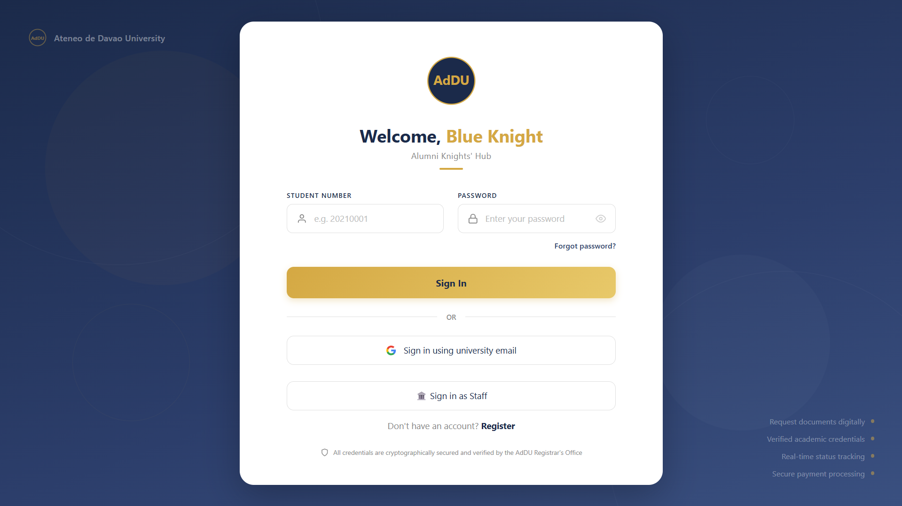
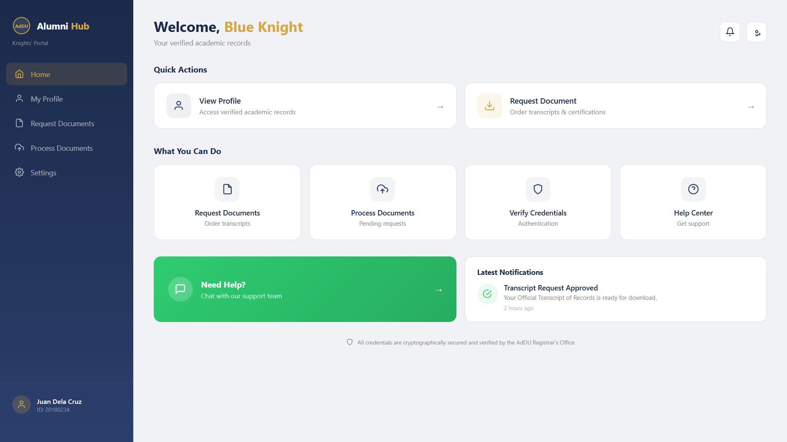
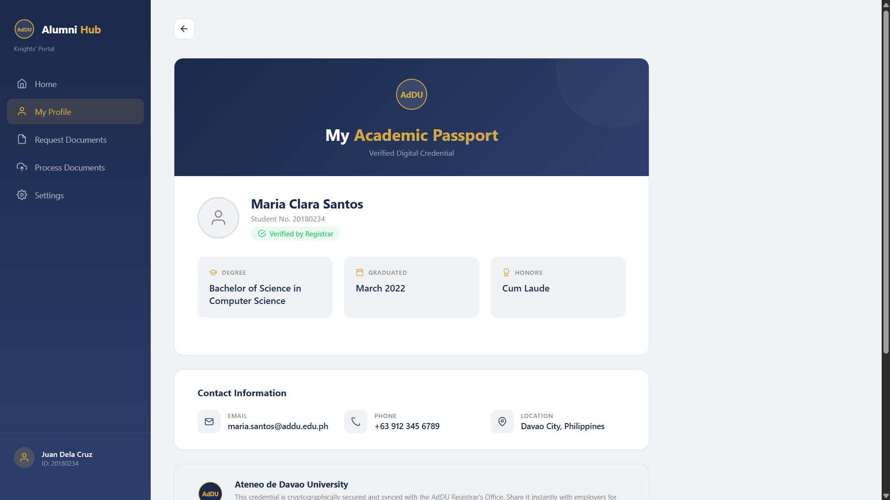
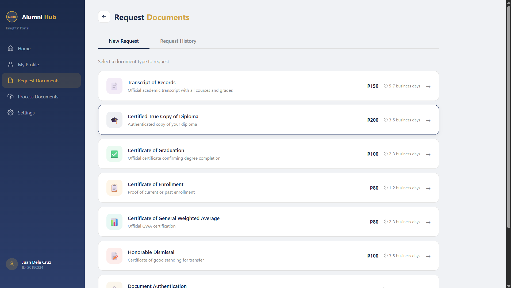
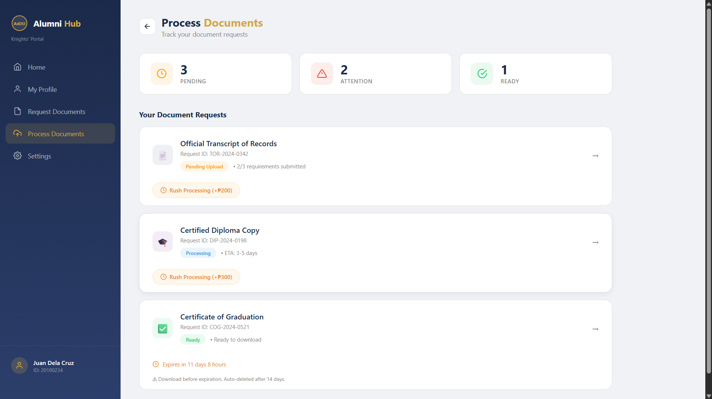
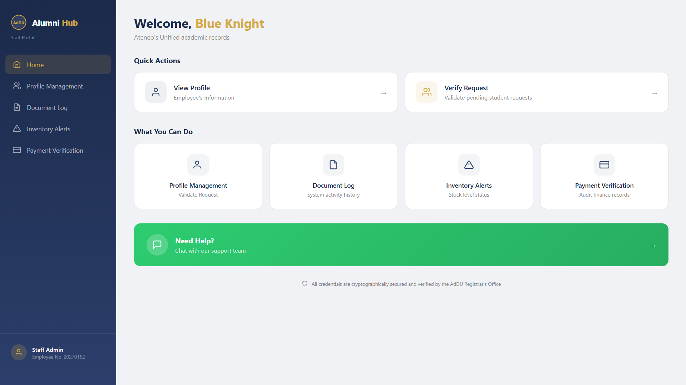
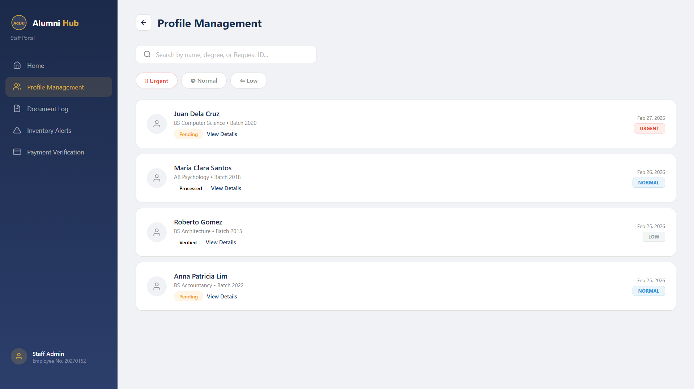
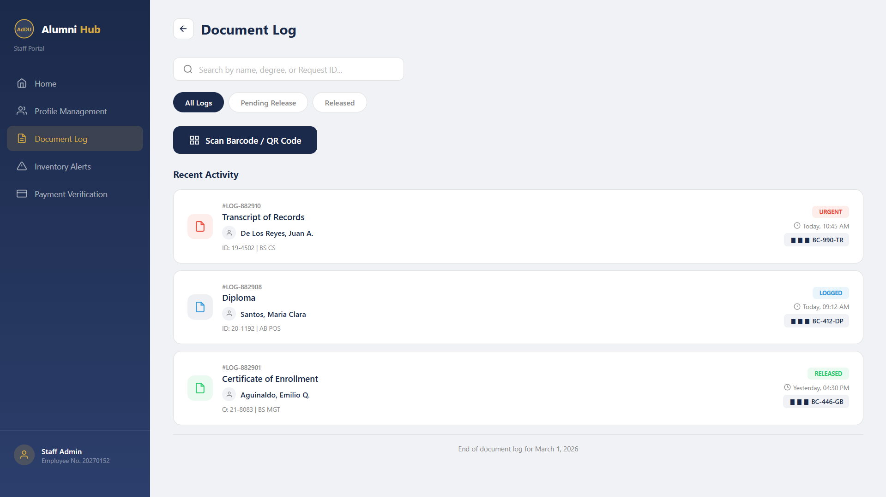
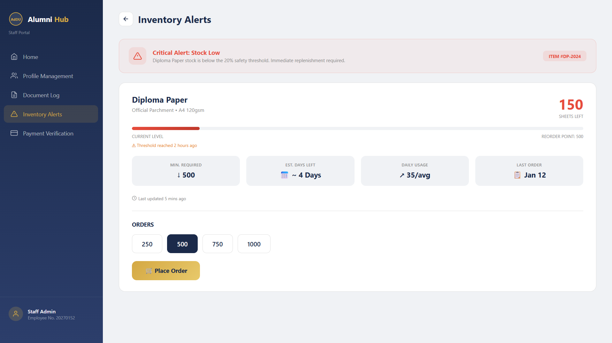
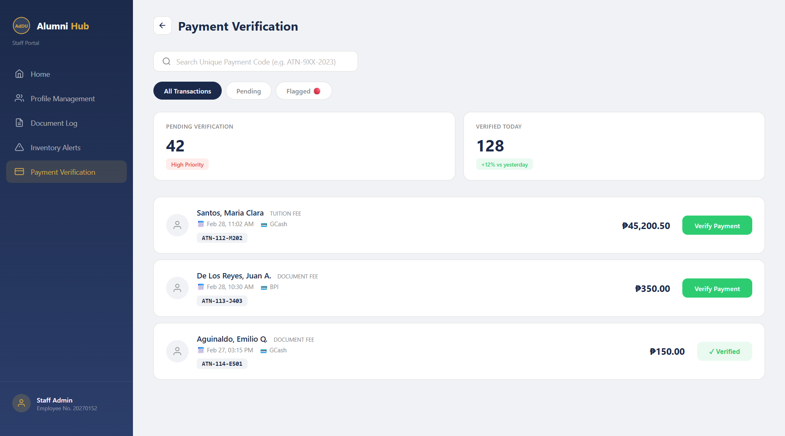

## Cabrera

#### Framework: SolidJS
#### Module: Document Request

#### Installation
To replicate and run this project follow the following steps using Windows Powershell:

```bash
winget install OpenJS.NodeJS.LTS
nvm install lts
nvm use lts
git clone https://github.com/jjcabrera-os/firstattempt2026_cabrera
cd firstattempt2026_cabrera
npm install
npm run dev


AI Tools:
Gemini

VS Code - Github Copilot

Prompt:
Files Attached: App.jsx, App.css, [AppDev] Act#10 Documentation.pdf

Project: Alumni Donation Web Application (SolidJS)
Overview: I'm building a frontend-only Alumni Donation Web Application using SolidJS. I need help replicating a set of reference design images (provided as a PDF) into a fully functional, high-fidelity interactive prototype. There is no backend or database — all flows should work as pure UI/UX (e.g., login proceeds even with blank fields).

Reference Designs: I will provide a PDF containing mobile mockups of each page. Each image corresponds to a specific page (identifiable by its title and purpose). These mobile designs must be adapted into a full desktop layout while preserving the visual intent, hierarchy, and interactions shown in the mockups.

⚠️ Centralization Preference: I prefer to keep everything as centralized as possible — fewer files is always better. Combine components, styles, and logic into shared files wherever it makes sense. Do not over-split into many small files. If something can live in one file without sacrificing readability, keep it in one file.

Screenshots

#### Screenshots

#### Screenshots



















